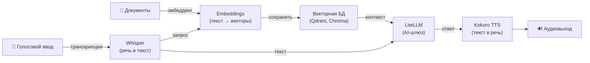

[English](README.md) | [简体中文](README-zh.md) | [繁體中文](README-zh-Hant.md) | [Русский](README-ru.md)

# LiteLLM AI-шлюз на Docker

[](https://github.com/hwdsl2/docker-litellm/actions/workflows/main.yml) &nbsp;[](https://opensource.org/licenses/MIT)

Docker-образ для запуска прокси-шлюза [LiteLLM](https://github.com/BerriAI/litellm). Обеспечивает единую точку доступа через OpenAI-совместимый API для более чем 100 провайдеров больших языковых моделей (LLM). Основан на Debian (python:3.12-slim). Прост в использовании, приватен и самостоятельно размещаем.

**Возможности:**

- Автоматически генерирует мастер-ключ API и конфигурацию при первом запуске
- Автоматически добавляет модели для провайдеров, ключи которых заданы в env-файле
- Управление моделями через вспомогательный скрипт (`litellm_manage`)
- База данных не требуется — модели хранятся в обычном YAML-файле на Docker-томе
- OpenAI-совместимый API — достаточно изменить одну строку, чтобы направить любое приложение или SDK на этот прокси
- Поддерживает OpenAI, Anthropic, Groq, Gemini, Ollama и [100+ других провайдеров](https://docs.litellm.ai/docs/providers)
- Автоматически собирается и публикуется через [GitHub Actions](https://github.com/hwdsl2/docker-litellm/actions/workflows/main.yml)
- Постоянное хранение данных через Docker-том
- Мультиархитектурная поддержка: `linux/amd64`, `linux/arm64`

**Также доступно:**

- ИИ/Аудио: [Whisper (STT)](https://github.com/hwdsl2/docker-whisper/blob/main/README-ru.md), [Kokoro (TTS)](https://github.com/hwdsl2/docker-kokoro/blob/main/README-ru.md), [Embeddings](https://github.com/hwdsl2/docker-embeddings/blob/main/README-ru.md)
- VPN: [WireGuard](https://github.com/hwdsl2/docker-wireguard/blob/main/README-ru.md), [OpenVPN](https://github.com/hwdsl2/docker-openvpn/blob/main/README-ru.md), [IPsec VPN](https://github.com/hwdsl2/docker-ipsec-vpn-server/blob/master/README-ru.md), [Headscale](https://github.com/hwdsl2/docker-headscale/blob/main/README-ru.md)

**Совет:** Whisper, Kokoro, Embeddings и LiteLLM можно [использовать совместно](#использование-с-другими-ai-сервисами) для построения полного приватного AI-стека на собственном сервере.

## Быстрый старт

**Шаг 1.** Запустите прокси LiteLLM:

```bash
docker run \
    --name litellm \
    --restart=always \
    -v litellm-data:/etc/litellm \
    -p 4000:4000/tcp \
    -d hwdsl2/litellm-server
```

При первом запуске сервер автоматически генерирует мастер-ключ API и создаёт конфигурацию. Мастер-ключ выводится в логах контейнера.

**Примечание:** Для развёртываний, доступных из интернета, **настоятельно рекомендуется** добавить HTTPS с помощью [обратного прокси](#использование-обратного-прокси). В этом случае также замените `-p 4000:4000/tcp` на `-p 127.0.0.1:4000:4000/tcp` в команде `docker run` выше, чтобы исключить прямой доступ к незашифрованному порту извне.

**Шаг 2.** Просмотрите логи контейнера, чтобы получить мастер-ключ:

```bash
docker logs litellm
```

Мастер-ключ отображается в рамке с заголовком **LiteLLM proxy master key**. Скопируйте этот ключ — он используется для аутентификации всех API-запросов.

**Примечание:** Мастер-ключ выводится только при первоначальной настройке. Чтобы отобразить его в любой момент, выполните:

```bash
docker exec litellm litellm_manage --showkey
```

**Шаг 3.** Проверьте работу прокси с помощью OpenAI-совместимого запроса:

```bash
# Получить список доступных моделей
curl http://localhost:4000/v1/models \
  -H "Authorization: Bearer <ваш-мастер-ключ>"

# Отправить запрос на генерацию текста (после добавления модели — см. ниже)
curl http://localhost:4000/v1/chat/completions \
  -H "Authorization: Bearer <ваш-мастер-ключ>" \
  -H "Content-Type: application/json" \
  -d '{"model": "gpt-4o", "messages": [{"role": "user", "content": "Привет!"}]}'
```

**Примечание:** Команда для отправки запроса на генерацию текста требует, чтобы сначала была настроена хотя бы одна модель. См. раздел [Управление моделями](#управление-моделями).

## Требования

- Сервер Linux (локальный или облачный) с установленным Docker
- Хотя бы один API-ключ провайдера LLM (OpenAI, Anthropic, Groq и др.) **или** локально запущенный экземпляр [Ollama](https://ollama.com)
- Открытый TCP-порт 4000 (или настроенный вами порт)

Запуск прокси возможен без ключей провайдеров LLM — сервер успешно стартует с пустым списком моделей. Модели можно добавить в любой момент с помощью `litellm_manage`.

Для развёртываний, доступных из интернета, см. раздел [Использование обратного прокси](#использование-обратного-прокси) для добавления HTTPS.

## Загрузка

Получите надёжную сборку из [реестра Docker Hub](https://hub.docker.com/r/hwdsl2/litellm-server/):

```bash
docker pull hwdsl2/litellm-server
```

Также можно загрузить из [Quay.io](https://quay.io/repository/hwdsl2/litellm-server):

```bash
docker pull quay.io/hwdsl2/litellm-server
docker image tag quay.io/hwdsl2/litellm-server hwdsl2/litellm-server
```

Поддерживаемые платформы: `linux/amd64` и `linux/arm64`.

## Переменные окружения

Все переменные необязательны. Если они не заданы, автоматически применяются безопасные значения по умолчанию.

Данный Docker-образ использует следующие переменные, которые можно объявить в файле `env` (см. [пример](litellm.env.example)):

| Переменная | Описание | По умолчанию |
|---|---|---|
| `LITELLM_MASTER_KEY` | Мастер-ключ API для прокси | Генерируется автоматически |
| `LITELLM_PORT` | TCP-порт для прокси (1–65535) | `4000` |
| `LITELLM_HOST` | Имя хоста или IP, отображаемое при запуске и в выводе `--showkey` | Определяется автоматически |
| `LITELLM_LOG_LEVEL` | Уровень логирования: `DEBUG`, `INFO`, `WARNING`, `ERROR`, `CRITICAL` | `INFO` |
| `LITELLM_OPENAI_API_KEY` | API-ключ OpenAI — автодобавляет `gpt-4o`, `gpt-4o-mini` | *(не задано)* |
| `LITELLM_ANTHROPIC_API_KEY` | API-ключ Anthropic — автодобавляет `claude-3-6-sonnet` (latest) | *(не задано)* |
| `LITELLM_GROQ_API_KEY` | API-ключ Groq — автодобавляет `llama-3.3-70b` | *(не задано)* |
| `LITELLM_GEMINI_API_KEY` | API-ключ Google Gemini — автодобавляет `gemini-2.0-flash` | *(не задано)* |
| `LITELLM_OLLAMA_BASE_URL` | Базовый URL Ollama — автодобавляет `ollama/llama3.2` | *(не задано)* |
| `LITELLM_DATABASE_URL` | URL PostgreSQL — включает управление виртуальными ключами | *(не задано)* |

**Примечание:** В файле `env` можно заключать значения в одинарные кавычки, например `VAR='значение'`. Не добавляйте пробелы вокруг `=`. Если вы изменили `LITELLM_PORT`, обновите флаг `-p` в команде `docker run` соответствующим образом.

Пример с использованием файла `env`:

```bash
cp litellm.env.example litellm.env
# Отредактируйте litellm.env и задайте ваши API-ключи, затем:
docker run \
    --name litellm \
    --restart=always \
    -v litellm-data:/etc/litellm \
    -v ./litellm.env:/litellm.env:ro \
    -p 4000:4000/tcp \
    -d hwdsl2/litellm-server
```

Файл env монтируется в контейнер через bind mount, поэтому изменения применяются при каждом перезапуске контейнера без его пересоздания.

## Управление моделями

Используйте `docker exec` для управления моделями через вспомогательный скрипт `litellm_manage`. Модели хранятся в файле `config.yaml` внутри Docker-тома и сохраняются после перезапуска контейнера.

**Примечание:** `--addmodel` и `--removemodel` записывают изменения в `config.yaml` и автоматически перезапускают прокси для их применения.

**Список настроенных моделей:**

```bash
docker exec litellm litellm_manage --listmodels
```

**Добавление модели с API-ключом:**

```bash
# OpenAI
docker exec litellm litellm_manage --addmodel openai/gpt-4o --key sk-...

# Anthropic
docker exec litellm litellm_manage --addmodel anthropic/claude-3-6-sonnet-latest --key sk-ant-...

# Groq
docker exec litellm litellm_manage --addmodel groq/llama-3.3-70b-versatile --key gsk_...

# Добавить с пользовательским отображаемым именем (псевдоним)
docker exec litellm litellm_manage --addmodel openai/gpt-4o --key sk-... --alias my-gpt4
```

**Добавление локальной модели Ollama:**

```bash
# Подключиться к Ollama, запущенному на хосте Docker
docker exec litellm litellm_manage \
  --addmodel ollama/llama3.2 \
  --base-url http://host.docker.internal:11434
```

**Удаление модели** (используйте поле `id` из вывода `--listmodels`):

```bash
docker exec litellm litellm_manage --removemodel <model_id>
```

**Показать мастер-ключ** (если нужно его найти):

```bash
docker exec litellm litellm_manage --showkey
```

## Управление виртуальными ключами

Виртуальные ключи — это ограниченные API-ключи, которые можно выдавать пользователям или приложениям. Каждый ключ может опционально ограничивать доступные модели, устанавливать максимальный бюджет расходов и срок действия. Виртуальные ключи требуют базы данных PostgreSQL — задайте `LITELLM_DATABASE_URL` в файле `env` перед запуском контейнера.

**Создать виртуальный ключ:**

```bash
# Базовый ключ (без ограничений)
docker exec litellm litellm_manage --createkey

# Ключ с псевдонимом, ограничением моделей, бюджетом и сроком действия
docker exec litellm litellm_manage --createkey \
  --alias dev-key \
  --models gpt-4o,claude-3-6-sonnet \
  --budget 20.0 \
  --expires 30d
```

**Список всех виртуальных ключей:**

```bash
docker exec litellm litellm_manage --listkeys
```

**Удалить виртуальный ключ:**

```bash
docker exec litellm litellm_manage --deletekey sk-...
```

## Использование с OpenAI SDK

Направьте любое приложение, использующее OpenAI SDK, на ваш прокси, задав две переменные окружения:

```bash
export OPENAI_API_KEY="<ваш-мастер-ключ>"
export OPENAI_BASE_URL="http://<IP-сервера>:4000"
```

Пример на Python:

```python
from openai import OpenAI

client = OpenAI(
    api_key="<ваш-мастер-ключ>",
    base_url="http://<IP-сервера>:4000",
)

response = client.chat.completions.create(
    model="gpt-4o",
    messages=[{"role": "user", "content": "Привет!"}],
)
print(response.choices[0].message.content)
```

## Постоянное хранение данных

Все данные прокси хранятся в Docker-томе (в контейнере — папка `/etc/litellm`):

```
/etc/litellm/
├── config.yaml       # Конфигурация прокси и список моделей (создаётся один раз, сохраняется при перезапуске)
├── .master_key       # Мастер-ключ API (автосгенерированный или синхронизированный из LITELLM_MASTER_KEY)
├── .initialized      # Маркер первого запуска
├── .server_addr      # Кэшированное имя хоста или IP сервера (используется litellm_manage --showkey)
└── .db_configured    # Присутствует, когда задан LITELLM_DATABASE_URL (используется litellm_manage)
```

Создавайте резервные копии Docker-тома для сохранения мастер-ключа и настроенных моделей.

## Использование docker-compose

```bash
cp litellm.env.example litellm.env
# Отредактируйте litellm.env и задайте ваши API-ключи, затем:
docker compose up -d
docker logs litellm
```

Пример `docker-compose.yml` (уже включён):

```yaml
services:
  litellm:
    image: hwdsl2/litellm-server
    container_name: litellm
    restart: always
    ports:
      - "4000:4000/tcp"  # For a host-based reverse proxy, change to "127.0.0.1:4000:4000/tcp"
    volumes:
      - litellm-data:/etc/litellm
      - ./litellm.env:/litellm.env:ro

volumes:
  litellm-data:
```

**Примечание:** Для развёртываний, доступных из интернета, **настоятельно рекомендуется** добавить HTTPS с помощью [обратного прокси](#использование-обратного-прокси). В этом случае также замените `"4000:4000/tcp"` на `"127.0.0.1:4000:4000/tcp"` в файле `docker-compose.yml`, чтобы исключить прямой доступ к незашифрованному порту извне.

## Использование обратного прокси

Для развёртываний, доступных из интернета, вы можете поставить обратный прокси перед прокси LiteLLM для обработки завершения HTTPS. На локальной или доверенной сети прокси работает без HTTPS, однако HTTPS рекомендуется, когда конечная точка API доступна из интернета.

Для обращения к контейнеру LiteLLM из обратного прокси используйте один из следующих адресов:

- **`litellm:4000`** — если обратный прокси работает как контейнер в **той же Docker-сети**, что и LiteLLM (например, определён в одном `docker-compose.yml`). Docker автоматически разрешает имя контейнера.
- **`127.0.0.1:4000`** — если обратный прокси работает **на хосте**, а порт `4000` опубликован (стандартный `docker-compose.yml` публикует этот порт).

**Пример с [Caddy](https://caddyserver.com/docs/) ([Docker-образ](https://hub.docker.com/_/caddy))** (автоматический TLS через Let's Encrypt, обратный прокси в той же Docker-сети):

`Caddyfile`:
```
litellm.example.com {
  reverse_proxy litellm:4000
}
```

**Пример с nginx** (обратный прокси на хосте):

```nginx
server {
  listen 443 ssl;
  server_name litellm.example.com;

  ssl_certificate     /path/to/cert.pem;
  ssl_certificate_key /path/to/key.pem;

  location / {
    proxy_pass http://127.0.0.1:4000;
    proxy_set_header Host $host;
    proxy_set_header X-Real-IP $remote_addr;
    proxy_set_header X-Forwarded-For $proxy_add_x_forwarded_for;
    proxy_set_header X-Forwarded-Proto $scheme;
    proxy_read_timeout 300s;
    proxy_buffering off;
  }
}
```

После настройки обратного прокси задайте `LITELLM_HOST=litellm.example.com` в файле `env`, чтобы правильный URL конечной точки отображался в логах запуска и в выводе `litellm_manage --showkey`.

Автоматически сгенерированный мастер-ключ API обязателен для всех API-запросов. Храните его в безопасности, когда сервер доступен из публичного интернета.

## Обновление Docker-образа

Для обновления Docker-образа и контейнера сначала [загрузите](#загрузка) последнюю версию:

```bash
docker pull hwdsl2/litellm-server
```

Если образ уже актуален, вы увидите:

```
Status: Image is up to date for hwdsl2/litellm-server:latest
```

В противном случае будет загружена последняя версия. Удалите и пересоздайте контейнер:

```bash
docker rm -f litellm
# Затем выполните команду docker run из раздела «Быстрый старт» с теми же томом и портом.
```

Ваши данные сохраняются в томе `litellm-data`.

## Использование с другими AI-сервисами

Образы [Whisper (STT)](https://github.com/hwdsl2/docker-whisper/blob/main/README-ru.md), [Embeddings](https://github.com/hwdsl2/docker-embeddings/blob/main/README-ru.md), [LiteLLM](https://github.com/hwdsl2/docker-litellm/blob/main/README-ru.md) и [Kokoro (TTS)](https://github.com/hwdsl2/docker-kokoro/blob/main/README-ru.md) можно объединить для создания полного приватного AI-стека на собственном сервере — от голосового ввода/вывода до RAG-поиска с ответами. Whisper, Kokoro и Embeddings работают полностью локально. При использовании LiteLLM только с локальными моделями (например, Ollama) данные не передаются третьим сторонам. Если вы настроите LiteLLM с внешними провайдерами (например, OpenAI, Anthropic), ваши данные будут переданы этим провайдерам для обработки.



| Сервис | Назначение | Порт по умолчанию |
|---|---|---|
| **[Embeddings](https://github.com/hwdsl2/docker-embeddings/blob/main/README-ru.md)** | Преобразует текст в векторы для семантического поиска и RAG | `8000` |
| **[Whisper (STT)](https://github.com/hwdsl2/docker-whisper/blob/main/README-ru.md)** | Транскрибирует речь в текст | `9000` |
| **[LiteLLM](https://github.com/hwdsl2/docker-litellm/blob/main/README-ru.md)** | AI-шлюз — маршрутизирует запросы к OpenAI, Anthropic, Ollama и 100+ другим провайдерам | `4000` |
| **[Kokoro (TTS)](https://github.com/hwdsl2/docker-kokoro/blob/main/README-ru.md)** | Синтезирует естественно звучащую речь из текста | `8880` |

### Пример: голосовой конвейер

Транскрибируйте голосовой вопрос, получите ответ от LLM и синтезируйте его в речь:

```bash
# Шаг 1: Транскрибировать аудио в текст (Whisper)
TEXT=$(curl -s http://localhost:9000/v1/audio/transcriptions \
    -F file=@question.mp3 -F model=whisper-1 | jq -r .text)

# Шаг 2: Отправить текст в LLM и получить ответ (LiteLLM)
RESPONSE=$(curl -s http://localhost:4000/v1/chat/completions \
    -H "Authorization: Bearer <your-litellm-key>" \
    -H "Content-Type: application/json" \
    -d "{\"model\":\"gpt-4o\",\"messages\":[{\"role\":\"user\",\"content\":\"$TEXT\"}]}" \
    | jq -r '.choices[0].message.content')

# Шаг 3: Преобразовать ответ в речь (Kokoro TTS)
curl -s http://localhost:8880/v1/audio/speech \
    -H "Content-Type: application/json" \
    -d "{\"model\":\"tts-1\",\"input\":\"$RESPONSE\",\"voice\":\"af_heart\"}" \
    --output response.mp3
```

### Пример: конвейер RAG

Индексируйте документы для семантического поиска, затем извлекайте контекст и отвечайте на вопросы с помощью LLM:

```bash
# Шаг 1: Получить вектор фрагмента документа и сохранить его в векторной БД
curl -s http://localhost:8000/v1/embeddings \
    -H "Content-Type: application/json" \
    -d '{"input": "Docker simplifies deployment by packaging apps in containers.", "model": "text-embedding-ada-002"}' \
    | jq '.data[0].embedding'
# → Сохраните возвращённый вектор вместе с исходным текстом в Qdrant, Chroma, pgvector и т.д.

# Шаг 2: При запросе — получить вектор вопроса, найти подходящие фрагменты
#          в векторной БД, затем передать вопрос и контекст в LiteLLM.
curl -s http://localhost:4000/v1/chat/completions \
    -H "Authorization: Bearer <your-litellm-key>" \
    -H "Content-Type: application/json" \
    -d '{
      "model": "gpt-4o",
      "messages": [
        {"role": "system", "content": "Отвечай только на основе предоставленного контекста."},
        {"role": "user", "content": "Что делает Docker?\n\nКонтекст: Docker упрощает развёртывание, упаковывая приложения в контейнеры."}
      ]
    }' \
    | jq -r '.choices[0].message.content'
```

## Технические подробности

- Базовый образ: `python:3.12-slim` (Debian)
- Среда выполнения: Python 3 (виртуальное окружение в `/opt/venv`)
- LiteLLM: последняя версия `litellm[proxy]` из PyPI
- Директория данных: `/etc/litellm` (Docker-том)
- Хранение моделей: `config.yaml` внутри тома — создаётся при первом запуске, сохраняется при перезапусках
- REST API управления прокси: работает на том же порту, что и прокси
- Встроенный UI: доступен по адресу `http://<сервер>:<порт>/ui`

## Лицензия

**Примечание:** Программные компоненты внутри предсобранного образа (такие как LiteLLM и его зависимости) распространяются под соответствующими лицензиями, выбранными их правообладателями. При использовании любого предсобранного образа пользователь несёт ответственность за соблюдение всех соответствующих лицензий на программное обеспечение, содержащееся в образе.

Авторские права (C) 2026 Lin Song   
Данная работа распространяется на условиях [лицензии MIT](https://opensource.org/licenses/MIT).

**LiteLLM** — авторские права (C) 2023 Berri AI, распространяется на условиях [лицензии MIT](https://github.com/BerriAI/litellm/blob/main/LICENSE).

Этот проект представляет собой независимую Docker-конфигурацию для LiteLLM и не связан с компанией Berri AI, разработчиком LiteLLM, а также не одобрен и не спонсируется ею。