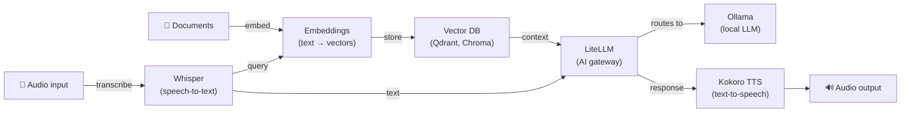

[English](README.md) | [简体中文](README-zh.md) | [繁體中文](README-zh-Hant.md) | [Русский](README-ru.md)

# LiteLLM AI Gateway on Docker

[](https://github.com/hwdsl2/docker-litellm/actions/workflows/main.yml) &nbsp;[](https://opensource.org/licenses/MIT)

Docker image to run a [LiteLLM](https://github.com/BerriAI/litellm) AI gateway proxy. Provides a single OpenAI-compatible API endpoint in front of 100+ LLM providers. Based on Debian (python:3.12-slim). Designed to be simple, private, and self-hosted.

**Features:**

- Automatically generates a master API key and config on first start
- Auto-adds models for any provider API keys set in the env file
- Model management via a helper script (`litellm_manage`)
- No database required — models are stored in a plain YAML file on the Docker volume
- OpenAI-compatible API — point any OpenAI SDK or app at your proxy with a one-line change
- Supports OpenAI, Anthropic, Groq, Gemini, Ollama, and [100+ other providers](https://docs.litellm.ai/docs/providers)
- Automatically built and published via [GitHub Actions](https://github.com/hwdsl2/docker-litellm/actions/workflows/main.yml)
- Persistent data via a Docker volume
- Multi-arch: `linux/amd64`, `linux/arm64`

**Also available:**

- AI/Audio: [Whisper (STT)](https://github.com/hwdsl2/docker-whisper), [Kokoro (TTS)](https://github.com/hwdsl2/docker-kokoro), [Embeddings](https://github.com/hwdsl2/docker-embeddings), [Ollama](https://github.com/hwdsl2/docker-ollama)
- VPN: [WireGuard](https://github.com/hwdsl2/docker-wireguard), [OpenVPN](https://github.com/hwdsl2/docker-openvpn), [IPsec VPN](https://github.com/hwdsl2/docker-ipsec-vpn-server), [Headscale](https://github.com/hwdsl2/docker-headscale)

**Tip:** Whisper, Kokoro, Embeddings, LiteLLM, and Ollama can be [used together](#using-with-other-ai-services) to build a complete, private AI stack on your own server.

## Quick start

**Step 1.** Start the LiteLLM proxy:

```bash
docker run \
    --name litellm \
    --restart=always \
    -v litellm-data:/etc/litellm \
    -p 4000:4000/tcp \
    -d hwdsl2/litellm-server
```

On first start, the server automatically generates a master API key and creates a config. The master key is printed to the container logs.

**Note:** For internet-facing deployments, using a [reverse proxy](#using-a-reverse-proxy) to add HTTPS is **strongly recommended**. In that case, also replace `-p 4000:4000/tcp` with `-p 127.0.0.1:4000:4000/tcp` in the `docker run` command above, to prevent direct access to the unencrypted port.

**Step 2.** View the container logs to get the master key:

```bash
docker logs litellm
```

The master key is displayed in a box labeled **LiteLLM proxy master key**. Copy this key — you will use it to authenticate all API requests.

**Note:** The master key is only printed during the first-run setup. To display it again at any time, run:

```bash
docker exec litellm litellm_manage --showkey
```

**Step 3.** Test the proxy with an OpenAI-compatible request:

```bash
# List available models
curl http://localhost:4000/v1/models \
  -H "Authorization: Bearer <your-master-key>"

# Send a chat completion (after adding a model — see below)
curl http://localhost:4000/v1/chat/completions \
  -H "Authorization: Bearer <your-master-key>" \
  -H "Content-Type: application/json" \
  -d '{"model": "gpt-4o", "messages": [{"role": "user", "content": "Hello!"}]}'
```

**Note:** The chat completion command above requires a model to be configured first. See [Model management](#model-management).

To learn more about how to use this image, read the sections below.

## Requirements

- A Linux server (local or cloud) with Docker installed
- At least one LLM provider API key (OpenAI, Anthropic, Groq, etc.) **or** a locally running [Ollama](https://ollama.com) instance
- TCP port 4000 (or your configured port) open and accessible

No LLM provider keys are required to start the proxy — the server starts successfully with an empty model list. Add models at any time using `litellm_manage`.

For internet-facing deployments, see [Using a reverse proxy](#using-a-reverse-proxy) to add HTTPS.

## Download

Get the trusted build from the [Docker Hub registry](https://hub.docker.com/r/hwdsl2/litellm-server/):

```bash
docker pull hwdsl2/litellm-server
```

Alternatively, you may download from [Quay.io](https://quay.io/repository/hwdsl2/litellm-server):

```bash
docker pull quay.io/hwdsl2/litellm-server
docker image tag quay.io/hwdsl2/litellm-server hwdsl2/litellm-server
```

Supported platforms: `linux/amd64` and `linux/arm64`.

## Environment variables

All variables are optional. If not set, secure defaults are used automatically.

This Docker image uses the following variables, that can be declared in an `env` file (see [example](litellm.env.example)):

| Variable | Description | Default |
|---|---|---|
| `LITELLM_MASTER_KEY` | Master API key for the proxy | Auto-generated |
| `LITELLM_PORT` | TCP port for the proxy (1–65535) | `4000` |
| `LITELLM_HOST` | Hostname or IP shown in startup info and `--showkey` output | Auto-detected |
| `LITELLM_LOG_LEVEL` | Log level: `DEBUG`, `INFO`, `WARNING`, `ERROR`, `CRITICAL` | `INFO` |
| `LITELLM_OPENAI_API_KEY` | OpenAI API key — auto-adds `gpt-4o`, `gpt-4o-mini` | *(not set)* |
| `LITELLM_ANTHROPIC_API_KEY` | Anthropic API key — auto-adds `claude-3-6-sonnet` (latest) | *(not set)* |
| `LITELLM_GROQ_API_KEY` | Groq API key — auto-adds `llama-3.3-70b` | *(not set)* |
| `LITELLM_GEMINI_API_KEY` | Google Gemini API key — auto-adds `gemini-2.0-flash` | *(not set)* |
| `LITELLM_OLLAMA_BASE_URL` | Ollama base URL — auto-adds `ollama/llama3.2` | *(not set)* |
| `LITELLM_DATABASE_URL` | PostgreSQL URL — enables virtual key management | *(not set)* |

**Note:** In your `env` file, you may enclose values in single quotes, e.g. `VAR='value'`. Do not add spaces around `=`. If you change `LITELLM_PORT`, update the `-p` flag in the `docker run` command accordingly.

Example using an `env` file:

```bash
cp litellm.env.example litellm.env
# Edit litellm.env and set your API keys, then:
docker run \
    --name litellm \
    --restart=always \
    -v litellm-data:/etc/litellm \
    -v ./litellm.env:/litellm.env:ro \
    -p 4000:4000/tcp \
    -d hwdsl2/litellm-server
```

The env file is bind-mounted into the container, so changes are picked up on every restart without recreating the container.

## Model management

Use `docker exec` to manage models with the `litellm_manage` helper script. Models are stored in `config.yaml` inside the Docker volume and persist across container restarts.

**Note:** `--addmodel` and `--removemodel` write to `config.yaml` and automatically restart the proxy to apply the change.

**List configured models:**

```bash
docker exec litellm litellm_manage --listmodels
```

**Add a model with an API key:**

```bash
# OpenAI
docker exec litellm litellm_manage --addmodel openai/gpt-4o --key sk-...

# Anthropic
docker exec litellm litellm_manage --addmodel anthropic/claude-3-6-sonnet-latest --key sk-ant-...

# Groq
docker exec litellm litellm_manage --addmodel groq/llama-3.3-70b-versatile --key gsk_...

# Add with a custom display name (alias)
docker exec litellm litellm_manage --addmodel openai/gpt-4o --key sk-... --alias my-gpt4
```

**Add a local Ollama model:**

```bash
# Connect to Ollama running on the Docker host
docker exec litellm litellm_manage \
  --addmodel ollama/llama3.2 \
  --base-url http://host.docker.internal:11434
```

**Remove a model** (use the `id` field from `--listmodels`):

```bash
docker exec litellm litellm_manage --removemodel <model_id>
```

**Show the master key** (if you need to look it up):

```bash
docker exec litellm litellm_manage --showkey
```

## Virtual key management

Virtual keys are scoped API keys you can issue to users or applications. Each key can optionally restrict which models it may access, set a maximum spend budget, and have an expiry. Virtual keys require a PostgreSQL database — set `LITELLM_DATABASE_URL` in your `env` file before starting the container.

**Create a virtual key:**

```bash
# Basic key (no restrictions)
docker exec litellm litellm_manage --createkey

# Key with alias, model restrictions, budget, and expiry
docker exec litellm litellm_manage --createkey \
  --alias dev-key \
  --models gpt-4o,claude-3-6-sonnet \
  --budget 20.0 \
  --expires 30d
```

**List all virtual keys:**

```bash
docker exec litellm litellm_manage --listkeys
```

**Delete a virtual key:**

```bash
docker exec litellm litellm_manage --deletekey sk-...
```

## Using the proxy with OpenAI SDK

Point any app that uses the OpenAI SDK at your proxy by setting two environment variables:

```bash
export OPENAI_API_KEY="<your-master-key>"
export OPENAI_BASE_URL="http://<server-ip>:4000"
```

For Python:

```python
from openai import OpenAI

client = OpenAI(
    api_key="<your-master-key>",
    base_url="http://<server-ip>:4000",
)

response = client.chat.completions.create(
    model="gpt-4o",
    messages=[{"role": "user", "content": "Hello!"}],
)
print(response.choices[0].message.content)
```

The proxy is compatible with any tool or library that supports the OpenAI API format.

## Persistent data

All proxy data is stored in the Docker volume (`/etc/litellm` inside the container):

```
/etc/litellm/
├── config.yaml       # Proxy configuration and model list (created once, preserved across restarts)
├── .master_key       # Master API key (auto-generated, or synced from LITELLM_MASTER_KEY)
├── .initialized      # First-run marker
├── .server_addr      # Cached server hostname or IP (used by litellm_manage --showkey)
└── .db_configured    # Present when LITELLM_DATABASE_URL is set (used by litellm_manage)
```

Back up the Docker volume to preserve your master key and configured models.

## Using docker-compose

```bash
cp litellm.env.example litellm.env
# Edit litellm.env and set your API keys, then:
docker compose up -d
docker logs litellm
```

Example `docker-compose.yml` (already included):

```yaml
services:
  litellm:
    image: hwdsl2/litellm-server
    container_name: litellm
    restart: always
    ports:
      - "4000:4000/tcp"  # For a host-based reverse proxy, change to "127.0.0.1:4000:4000/tcp"
    volumes:
      - litellm-data:/etc/litellm
      - ./litellm.env:/litellm.env:ro

volumes:
  litellm-data:
```

**Note:** For internet-facing deployments, using a [reverse proxy](#using-a-reverse-proxy) to add HTTPS is **strongly recommended**. In that case, also change `"4000:4000/tcp"` to `"127.0.0.1:4000:4000/tcp"` in `docker-compose.yml`, to prevent direct access to the unencrypted port.

## Using a reverse proxy

For internet-facing deployments, you may want to put a reverse proxy in front of the LiteLLM proxy to handle HTTPS termination. The proxy works without HTTPS on a local or trusted network, but HTTPS is recommended when the API endpoint is exposed to the internet.

Use one of the following addresses to reach the LiteLLM container from your reverse proxy:

- **`litellm:4000`** — if your reverse proxy runs as a container in the **same Docker network** as LiteLLM (e.g. defined in the same `docker-compose.yml`). Docker resolves the container name automatically.
- **`127.0.0.1:4000`** — if your reverse proxy runs **on the host** and port `4000` is published (the default `docker-compose.yml` publishes it).

**Example with [Caddy](https://caddyserver.com/docs/) ([Docker image](https://hub.docker.com/_/caddy))** (automatic TLS via Let's Encrypt, reverse proxy in the same Docker network):

`Caddyfile`:
```
litellm.example.com {
  reverse_proxy litellm:4000
}
```

**Example with nginx** (reverse proxy on the host):

```nginx
server {
  listen 443 ssl;
  server_name litellm.example.com;

  ssl_certificate     /path/to/cert.pem;
  ssl_certificate_key /path/to/key.pem;

  location / {
    proxy_pass http://127.0.0.1:4000;
    proxy_set_header Host $host;
    proxy_set_header X-Real-IP $remote_addr;
    proxy_set_header X-Forwarded-For $proxy_add_x_forwarded_for;
    proxy_set_header X-Forwarded-Proto $scheme;
    proxy_read_timeout 300s;
    proxy_buffering off;
  }
}
```

After setting up a reverse proxy, set `LITELLM_HOST=litellm.example.com` in your `env` file so that the correct endpoint URL is shown in the startup logs and `litellm_manage --showkey` output.

The auto-generated master API key is required for all API requests. Keep it secure when the server is accessible from the public internet.

## Update Docker image

To update the Docker image and container, first [download](#download) the latest version:

```bash
docker pull hwdsl2/litellm-server
```

If the Docker image is already up to date, you should see:

```
Status: Image is up to date for hwdsl2/litellm-server:latest
```

Otherwise, it will download the latest version. Remove and re-create the container:

```bash
docker rm -f litellm
# Then re-run the docker run command from Quick start with the same volume and port.
```

Your data is preserved in the `litellm-data` volume.

## Using with other AI services

The [Whisper (STT)](https://github.com/hwdsl2/docker-whisper), [Embeddings](https://github.com/hwdsl2/docker-embeddings), [LiteLLM](https://github.com/hwdsl2/docker-litellm), [Kokoro (TTS)](https://github.com/hwdsl2/docker-kokoro), and [Ollama](https://github.com/hwdsl2/docker-ollama) images can be combined to build a complete, private AI stack on your own server — from voice I/O to RAG-powered question answering. Whisper, Kokoro, and Embeddings run fully locally. Ollama runs all LLM inference locally, so no data is sent to third parties. When using LiteLLM with external providers (e.g., OpenAI, Anthropic), your data will be sent to those providers.



| Service | Role | Default port |
|---|---|---|
| **[Embeddings](https://github.com/hwdsl2/docker-embeddings)** | Converts text to vectors for semantic search and RAG | `8000` |
| **[Whisper (STT)](https://github.com/hwdsl2/docker-whisper)** | Transcribes spoken audio to text | `9000` |
| **[LiteLLM](https://github.com/hwdsl2/docker-litellm)** | AI gateway — routes requests to OpenAI, Anthropic, Ollama, and 100+ other providers | `4000` |
| **[Kokoro (TTS)](https://github.com/hwdsl2/docker-kokoro)** | Converts text to natural-sounding speech | `8880` |
| **[Ollama](https://github.com/hwdsl2/docker-ollama)** | Runs local LLM models (llama3, qwen, mistral, etc.) | `11434` |

<details>
<summary><strong>Voice pipeline example</strong></summary>

Transcribe a spoken question, get an LLM response, and convert it to speech:

```bash
# Step 1: Transcribe audio to text (Whisper)
TEXT=$(curl -s http://localhost:9000/v1/audio/transcriptions \
    -F file=@question.mp3 -F model=whisper-1 | jq -r .text)

# Step 2: Send text to an LLM and get a response (LiteLLM)
RESPONSE=$(curl -s http://localhost:4000/v1/chat/completions \
    -H "Authorization: Bearer <your-litellm-key>" \
    -H "Content-Type: application/json" \
    -d "{\"model\":\"gpt-4o\",\"messages\":[{\"role\":\"user\",\"content\":\"$TEXT\"}]}" \
    | jq -r '.choices[0].message.content')

# Step 3: Convert the response to speech (Kokoro TTS)
curl -s http://localhost:8880/v1/audio/speech \
    -H "Content-Type: application/json" \
    -d "{\"model\":\"tts-1\",\"input\":\"$RESPONSE\",\"voice\":\"af_heart\"}" \
    --output response.mp3
```

</details>

<details>
<summary><strong>RAG pipeline example</strong></summary>

Embed documents for semantic search, then retrieve context and answer questions with an LLM:

```bash
# Step 1: Embed a document chunk and store the vector in your vector DB
curl -s http://localhost:8000/v1/embeddings \
    -H "Content-Type: application/json" \
    -d '{"input": "Docker simplifies deployment by packaging apps in containers.", "model": "text-embedding-ada-002"}' \
    | jq '.data[0].embedding'
# → Store the returned vector alongside the source text in Qdrant, Chroma, pgvector, etc.

# Step 2: At query time, embed the question, retrieve the top matching chunks from
#          the vector DB, then send the question and retrieved context to LiteLLM.
curl -s http://localhost:4000/v1/chat/completions \
    -H "Authorization: Bearer <your-litellm-key>" \
    -H "Content-Type: application/json" \
    -d '{
      "model": "gpt-4o",
      "messages": [
        {"role": "system", "content": "Answer using only the provided context."},
        {"role": "user", "content": "What does Docker do?\n\nContext: Docker simplifies deployment by packaging apps in containers."}
      ]
    }' \
    | jq -r '.choices[0].message.content'
```

</details>

<details>
<summary><strong>Full stack docker-compose example</strong></summary>

Deploy all services with a single command. LiteLLM connects to Ollama internally via the shared Docker network — set `LITELLM_OLLAMA_BASE_URL=http://ollama:11434` in `litellm.env`.

**Resource requirements:** Running all services together requires at least 8 GB of RAM (with small models). For larger LLM models (8B+), 32 GB or more is recommended. You can comment out services you don't need to reduce memory usage.

```yaml
services:
  ollama:
    image: hwdsl2/ollama-server
    container_name: ollama
    restart: always
    # ports:
    #   - "11434:11434/tcp"  # Uncomment for direct access to Ollama
    volumes:
      - ollama-data:/var/lib/ollama
      - ./ollama.env:/ollama.env:ro

  litellm:
    image: hwdsl2/litellm-server
    container_name: litellm
    restart: always
    ports:
      - "4000:4000/tcp"
    volumes:
      - litellm-data:/etc/litellm
      - ./litellm.env:/litellm.env:ro

  embeddings:
    image: hwdsl2/embeddings-server
    container_name: embeddings
    restart: always
    ports:
      - "8000:8000/tcp"
    volumes:
      - embeddings-data:/var/lib/embeddings
      - ./embed.env:/embed.env:ro

  whisper:
    image: hwdsl2/whisper-server
    container_name: whisper
    restart: always
    ports:
      - "9000:9000/tcp"
    volumes:
      - whisper-data:/var/lib/whisper
      - ./whisper.env:/whisper.env:ro

  kokoro:
    image: hwdsl2/kokoro-server
    container_name: kokoro
    restart: always
    ports:
      - "8880:8880/tcp"
    volumes:
      - kokoro-data:/var/lib/kokoro
      - ./kokoro.env:/kokoro.env:ro

volumes:
  ollama-data:
  litellm-data:
  embeddings-data:
  whisper-data:
  kokoro-data:
```

For NVIDIA GPU acceleration, change image tags to `:cuda` for ollama, whisper, and kokoro, and add the following to each of those services:

```yaml
    deploy:
      resources:
        reservations:
          devices:
            - driver: nvidia
              count: 1
              capabilities: [gpu]
```

</details>

## Technical details

- Base image: `python:3.12-slim` (Debian)
- Runtime: Python 3 (virtual environment at `/opt/venv`)
- LiteLLM: latest `litellm[proxy]` from PyPI
- Data directory: `/etc/litellm` (Docker volume)
- Model storage: `config.yaml` inside the volume — created on first start, preserved on restarts
- Proxy management REST API: runs on the same port as the proxy
- Built-in UI: available at `http://<server>:<port>/ui`

## License

**Note:** The software components inside the pre-built image (such as LiteLLM and its dependencies) are under the respective licenses chosen by their respective copyright holders. As for any pre-built image usage, it is the image user's responsibility to ensure that any use of this image complies with any relevant licenses for all software contained within.

Copyright (C) 2026 Lin Song   
This work is licensed under the [MIT License](https://opensource.org/licenses/MIT).

**LiteLLM** is Copyright (C) 2023 Berri AI, and is distributed under the [MIT License](https://github.com/BerriAI/litellm/blob/main/LICENSE).

This project is an independent Docker setup for LiteLLM and is not affiliated with, endorsed by, or sponsored by Berri AI, the creators of LiteLLM.